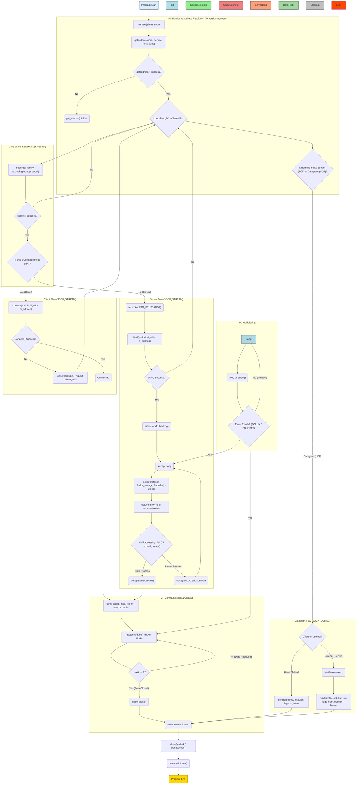

# Note of [Beej's Guide to Network Programming](https://beej.us/guide/bgnet/html/)

Two Types of Internet Sockets:

- SOCK_STREAM
- SOCK_DGRAM


Remember this for network class exams:

- Application
- Presentation
- Session
- Transport
- Network
- Data Link
- Physical

A layered model more consistent with Unix ：

- Application Layer (telnet, ftp, etc.)
- 应用层（telnet、ftp 等）
- Host-to-Host Transport Layer (TCP, UDP)
- 主机到主机传输层（TCP、UDP）
- Internet Layer (IP and routing)
- 互联网层（IP 和路由）
- Network Access Layer (Ethernet, wi-fi, or whatever)
- 网络访问层（以太网、wi-fi 或其他）


```C
struct addrinfo {
    int              ai_flags;     // AI_PASSIVE, AI_CANONNAME, etc.
    int              ai_family;    // AF_INET, AF_INET6, AF_UNSPEC
    int              ai_socktype;  // SOCK_STREAM, SOCK_DGRAM
    int              ai_protocol;  // use 0 for "any"
    size_t           ai_addrlen;   // size of ai_addr in bytes
    struct sockaddr *ai_addr;      // struct sockaddr_in or _in6
    char            *ai_canonname; // full canonical hostname

    struct addrinfo *ai_next;      // linked list, next node
};

struct sockaddr {
    unsigned short    sa_family;    // address family, AF_xxx
    char              sa_data[14];  // 14 bytes of protocol address
}; 

// (IPv4 only--see struct sockaddr_in6 for IPv6)
struct sockaddr_in {
    short int          sin_family;  // Address family, AF_INET
    unsigned short int sin_port;    // Port number
    struct in_addr     sin_addr;    // Internet address
    unsigned char      sin_zero[8]; // Same size as struct sockaddr
};

// (IPv4 only--see struct in6_addr for IPv6)

// Internet address (a structure for historical reasons)
struct in_addr {
    uint32_t s_addr; // that's a 32-bit int (4 bytes)
};

// (IPv6 only--see struct sockaddr_in and struct in_addr for IPv4)
struct sockaddr_in6 {
    u_int16_t       sin6_family;   // address family, AF_INET6
    u_int16_t       sin6_port;     // port, Network Byte Order
    u_int32_t       sin6_flowinfo; // IPv6 flow information
    struct in6_addr sin6_addr;     // IPv6 address
    u_int32_t       sin6_scope_id; // Scope ID
};

struct in6_addr {
    unsigned char   s6_addr[16];   // IPv6 address
};

struct sockaddr_storage {
    sa_family_t  ss_family;     // address family

    // all this is padding, implementation specific, ignore it:
    char      __ss_pad1[_SS_PAD1SIZE];
    int64_t   __ss_align;
    char      __ss_pad2[_SS_PAD2SIZE];
};
```

## `sockaddr_storage`

它是为了解决 IPv4 和 IPv6 兼容性问题而设计的，是一个**足够大**的通用存储结构，旨在安全地容纳任何地址族的套接字地址数据。

### 1. 产生背景和设计目的

`struct sockaddr_storage` 存在的根本原因是历史遗留的通用地址结构 **`struct sockaddr` 不够大**，无法可靠地容纳 IPv6 地址所需的 128 位地址信息。

*   **设计目标：** 它的设计目的是作为一种**通用套接字地址持有结构**，其空间足以容纳 `struct sockaddr_in` (IPv4) 和 `struct sockaddr_in6` (IPv6) 的数据。
*   **IP 版本无关性（IP Version-Agnostic）：** 这个结构体是编写**与 IP 版本无关的代码**的关键工具。当你事先不知道传入的地址是 IPv4 还是 IPv6 时，应该使用它来存储接收到的地址信息，例如在使用 `accept()` 或 `recvfrom()` 等系统调用时。

### 2. 结构体定义与关键字段

`struct sockaddr_storage` 的定义如下：

```c
struct sockaddr_storage {
    sa_family_t ss_family; // address family
    // all this is padding, implementation specific, ignore it:
    char __ss_pad1[_SS_PAD1SIZE];
    int64_t __ss_align;
    char __ss_pad2[_SS_PAD2SIZE];
};
```

*   **`ss_family` 字段：** 结构体中最重要的是 `ss_family` 字段，它用于存储**地址族**（如 `AF_INET` 或 `AF_INET6`）。通过检查这个字段，程序员可以判断其中存储的是 IPv4 还是 IPv6 地址。
*   **填充和对齐：** 结构体中包含了 `__ss_pad1`、`__ss_align` 和 `__ss_pad2` 等字段，这些是**实现特定的填充和对齐**，编程时应当忽略它们。

### 3. 使用场景和操作方式

在实际的网络编程中，`struct sockaddr_storage` 通常作为地址信息的目标缓冲区：

1.  **作为通用存储：** 当调用 `accept()` 或 `recvfrom()` 时，如果不知道传入的地址是 IPv4 还是 IPv6，可以将指向 `struct sockaddr_storage` 实例的指针传入，并将其**强制转换为 `struct sockaddr *`** 类型。
2.  **获取地址族：** 当函数返回后，通过检查 `ss_family` 字段的值（`AF_INET` 或 `AF_INET6`），可以确定地址的类型。
3.  **强制转换和访问数据：** 一旦确定了地址族，就可以将其**强制转换为对应版本的结构体**（`struct sockaddr_in` 或 `struct sockaddr_in6`），从而安全地提取地址和端口信息。

例如，在服务器代码示例中，`accept()` 函数使用 `struct sockaddr_storage their_addr` 来接收连接客户端的地址信息。随后，代码通过 `their_addr.ss_family` 来判断地址类型，并将其转换为适当的指针类型（`struct sockaddr_in *` 或 `struct sockaddr_in6 *`）以提取 IP 地址和端口。

### 4. 与其他结构体的关系

*   **与 `struct sockaddr` 的关系：** 虽然 `struct sockaddr_storage` 是通用的，但在许多系统调用中，它仍需被**强制转换为 `struct sockaddr *`** 才能使用，因为后者是传统的、系统调用所需的地址结构指针类型。
*   **与 `getaddrinfo()` 的关系：** 尽管 `getaddrinfo()` 返回的是 `struct addrinfo` 的链接列表，但 `struct addrinfo` 结构内部包含的 `ai_addr` 字段是指向 `struct sockaddr` 的指针，而这最终可以指向（或包含）`struct sockaddr_storage` 所能容纳的实际地址数据（即 `struct sockaddr_in` 或 `struct sockaddr_in6`）。

## Functions which manipulate IP

```c
struct sockaddr_in sa;   // IPv4
struct sockaddr_in6 sa6; // IPv6

inet_pton(AF_INET, "10.12.110.57", &(sa.sin_addr));
inet_pton(AF_INET6, "2001:db8:63b3:1::3490", &(sa6.sin6_addr));

// IPv4:

char ip4[INET_ADDRSTRLEN];  // space to hold the IPv4 string
struct sockaddr_in sa;      // pretend this is loaded with something

inet_ntop(AF_INET, &(sa.sin_addr), ip4, INET_ADDRSTRLEN);

printf("The IPv4 address is: %s\n", ip4);


// IPv6:

char ip6[INET6_ADDRSTRLEN]; // space to hold the IPv6 string
struct sockaddr_in6 sa6;    // pretend this is loaded with something

inet_ntop(AF_INET6, &(sa6.sin6_addr), ip6, INET6_ADDRSTRLEN);

printf("The address is: %s\n", ip6);
```

在“地址、字节序与数据结构”的宏大背景下，来源资料详细讨论了用于**IP 地址转换**的关键函数，这些函数旨在实现地址在**人类可读的表示形式**（presentation form，如点分十进制或十六进制字符串）和**网络使用的二进制数据结构**（network form）之间的安全且可移植的转换。

来源对于 IP 地址转换函数的看法，核心在于强调 **IPv4 专用函数的过时性**，并强力推荐使用 **IPv6 兼容的现代函数**。

### 1. 现代 IP 地址转换函数（推荐使用）

来源明确推荐使用 `inet_pton()` 和 `inet_ntop()` 这对函数，因为它们支持 IPv4 和 IPv6，是编写现代、IP 版本无关代码的基础。

#### 1.1. `inet_pton()` (Presentation to Network)

*   **功能：** 该函数将 IP 地址的**人类可读的字符串形式**（“presentation”，或称为“printable”）转换为其**二进制表示形式**（“network”）。
*   **用途：** 程序员如果有一个 IP 地址字符串（例如 `"10.12.110.57"` 或 `"2001:db8:63b3:1::3490"`），希望将其存储到 `struct sockaddr_in` 或 `struct sockaddr_in6` 这样的结构体中，就需要使用此函数。
*   **兼容性：** 它通过 `af` (address family) 参数（可以是 `AF_INET` 或 `AF_INET6`）来支持 IPv4 和 IPv6。
*   **返回值：** 成功时返回 `1`；如果输入不是有效的 IP 地址，返回 `0`；出错时返回 `-1` 并设置 `errno`。

#### 1.2. `inet_ntop()` (Network to Presentation)

*   **功能：** 该函数执行相反的转换，将 IP 地址的**二进制形式**（存储在结构体中）转换为**人类可读的字符串形式**（“network to printable”）。
*   **用途：** 当程序从网络接收到一个地址结构（如在 `struct sockaddr_in` 或 `struct sockaddr_in6` 中）后，如果想打印或显示该地址，就需要使用此函数。
*   **参数要求：** 调用者必须提供一个目标字符串缓冲区 (`dst`) 及其最大长度 (`size`)。
*   **辅助宏：** 来源提供了两个宏来确保缓冲区足够大：`INET_ADDRSTRLEN`（用于 IPv4）和 `INET6_ADDRSTRLEN`（用于 IPv6）。

### 2. 过时的 IPv4 专用转换函数

来源强烈指出，旧的 IPv4 专用转换函数已经被 **`inet_pton()` 和 `inet_ntop()` 所取代（superseded/deprecated）**，因为它们不支持 IPv6。

| 函数 | 描述 | 状态 | 替换函数 |
| :--- | :--- | :--- | :--- |
| **`inet_addr()`** | 将点分十进制字符串转换为 `in_addr_t` (IP 地址整数)。 | **过时 (Obsolete)**。 | `inet_pton()`。 |
| **`inet_aton()`** | 将点分十进制字符串转换为 `struct in_addr` 结构。 | **过时 (Obsolete)**。 | `inet_pton()`。 |
| **`inet_ntoa()`** | 将 `struct in_addr` 转换为点分十进制字符串。 | **过时 (Obsolete)**。 | `inet_ntop()`。 |

**使用风险：**

*   `inet_ntoa()` 返回的字符串存储在一个**静态缓冲区**中，每次调用都会被覆盖。
*   `inet_addr()` 在出错时返回 `-1`，而这与有效的 IP 地址 `255.255.255.255` 的转换结果相同，因此使用 `inet_aton()` 进行错误检查相对更可靠。

### 3. 与 `getaddrinfo()` 的关系（地址查找与转换）

IP 地址转换函数仅处理数字 IP 地址字符串和二进制结构之间的转换，**它们不执行 DNS 名称查找**。

*   **高级抽象：** 现代网络编程推荐使用 **`getaddrinfo()`** 函数来完成更高级的地址处理，包括：
    *   **主机名查找：** 将主机名（如 `"www.example.com"`）转换为 IP 地址（这是 `inet_pton()` 无法做到的）。
    *   **IP 版本无关性：** `getaddrinfo()` 可以处理 IPv4 和 IPv6，并填充所需的 `struct sockaddr` 结构体，这大大简化了程序员手动调用 `inet_pton()` 并处理字节序（如端口号）的需要。
*   **逆向查找：** 相应的，若要将已加载的 `struct sockaddr` 进行逆向查找（即查找主机名和服务名），应当使用 **`getnameinfo()`**，而非过时的 `gethostbyaddr()`。

### 4. IP 地址转换与字节序（Byte Order）

IP 地址转换函数确保了地址部分（如 `struct in_addr` 或 `struct in6_addr`）是以**网络字节序**（Network Byte Order）存储的。

*   `inet_pton()` 负责将 IP 地址字符串转换为目标地址结构（`struct in_addr` 或 `struct in6_addr`），这个过程也包含了确保数据以网络字节序存储的逻辑。
*   然而，**端口号**（Port Number）是另一个 16 位整数，它需要单独处理。程序员在手动填充地址结构时，**必须**使用专门的字节序转换函数，例如 `htons()`，来确保端口号处于网络字节序，否则可能会导致通信错误。

## How to jump from ipv4 to v6

1.  First of all, try to use `getaddrinfo()` to get all the `struct sockaddr` info, instead of packing the structures by hand. This will keep you IP version-agnostic, and will eliminate many of the subsequent steps.
    
2.  Any place that you find you’re hard-coding anything related to the IP version, try to wrap up in a helper function.
    
3.  Change `AF_INET` to `AF_INET6`.
    
4.  Change `PF_INET` to `PF_INET6`.
    
5.  Change `INADDR_ANY` assignments to `in6addr_any` assignments, which are slightly different:
    
    ```c
    struct sockaddr_in sa;
    struct sockaddr_in6 sa6;
    sa.sin_addr.s_addr = INADDR_ANY;  // use my IPv4 address
    sa6.sin6_addr = in6addr_any; // use my IPv6 address
    ```
    
    Also, the value `IN6ADDR_ANY_INIT` can be used as an initializer when the `struct in6_addr` is declared, like so:
    
    ```c
    struct in6_addr ia6 = IN6ADDR_ANY_INIT;
    ```
    
6.  Instead of `struct sockaddr_in` use `struct sockaddr_in6`, being sure to add “6” to the fields as appropriate. There is no `sin6_zero` field.
    
7.  Instead of `struct in_addr` use `struct in6_addr`, being sure to add “6” to the fields as appropriate.
    
8.  Instead of `inet_aton()` or `inet_addr()`, use `inet_pton()`.
    
9.  Instead of `inet_ntoa()`, use `inet_ntop()`.
    
10.  Instead of `gethostbyname()`, use the superior `getaddrinfo()`.
    
11.  Instead of `gethostbyaddr()`, use the superior `getnameinfo()` (although `gethostbyaddr()` can still work with IPv6).
    
12.  `INADDR_BROADCAST` no longer works. Use IPv6 multicast instead.

## System Calls or Bust

-  `getaddrinfo()`—Prepare to launch!
-  `socket()`—Get the File Descriptor!
-  `bind()`—What port am I on?
-  `connect()`—Hey, you!
-  `listen()`—Will somebody please call me?
-  `accept()`—“Thank you for calling port 3490.”
-  `send()` and `recv()`—Talk to me, baby!
-  `sendto()` and `recvfrom()`—Talk to me, DGRAM-style
-  `close()` and `shutdown()`—Get outta my face!
-  `getpeername()`—Who are you?
-  `gethostname()`—Who am I?



“核心系统调用”（System Calls）访问 Unix（及兼容）系统网络功能的关键，但其使用顺序和组合方式对于初学者来说是最大的难点。

指南的目的是通过清晰地介绍这些系统调用及其正确的调用顺序，来帮助读者掌握网络编程。


### 1. 核心系统调用的定义和重要性

核心系统调用是允许程序访问网络功能的底层函数，当程序调用它们时，内核会自动接管并完成所有工作。

*   **功能核心：** Socket 编程的整个流程都围绕着这些系统调用展开。指南将这些调用以其在程序中需要的**近似顺序**进行排列和讲解，旨在解决用户在查阅 `man` 手册时遇到的困惑。
*   **文件描述符：** 许多网络操作都通过标准的 Unix 文件描述符进行，套接字描述符本身只是一个常规的 `int` 类型。

### 2. 推荐的现代系统调用（IP 版本无关性）

来源强烈建议使用现代化的系统调用，特别是 `getaddrinfo()`，以实现代码的 IP 版本无关性（IP version-agnostic），从而简化 IPv4 到 IPv6 的迁移。

| 系统调用 | 主要功能 | 重点看法 / 作用 |
| :--- | :--- | :--- |
| **`getaddrinfo()`** | **地址查找与结构体准备** | **现代编程的“主力”**。它取代了旧的 `gethostbyname()`，能同时进行 DNS 和服务名称查找，并返回一个包含 `struct sockaddr` 的链接列表 (`struct addrinfo`)，使代码不必关心 IPv4 或 IPv6。服务器端可使用 `AI_PASSIVE` 标志让它自动填充本地 IP 地址。|
| **`socket()`** | **创建套接字描述符** | 通常是网络编程的第一步。现代用法是从 `getaddrinfo()` 的结果中直接获取参数（`ai_family`, `ai_socktype`, `ai_protocol`），避免硬编码。|
| **`freeaddrinfo()`** | **释放地址信息** | 必须在完成对 `getaddrinfo()` 返回的链接列表使用后调用，以防止内存泄漏。|
| **`gai_strerror()`** | **错误报告** | 用于将 `getaddrinfo()` 返回的非零错误代码转换为可打印的字符串。|

### 3. 连接与数据传输的核心系统调用

这些调用定义了客户端（发起连接）和服务器端（接受连接）的基本行为：

#### 客户端/服务器通用操作：

*   **`bind()`**：将套接字绑定到本地机器上的特定 IP 地址和端口号。如果程序是客户端（只需 `connect()`），通常不需要调用 `bind()`，内核会自动选择一个未使用的本地端口。如果用于服务器，通常需要先调用 `getaddrinfo()` 并设置 `AI_PASSIVE` 标志。
*   **`connect()`**：用于客户端连接到远程服务器。如果未事先调用 `bind()`，`connect()` 会自动将套接字绑定到本地 IP 地址和随机端口。
*   **`close()`**：用于关闭套接字描述符，阻止进一步的读写操作并释放资源。**注意：Windows 用户应使用 `closesocket()` 代替**。
*   **`shutdown()`**：允许程序员更精细地控制关闭套接字的哪个方向（只停止发送、只停止接收或两者皆停止），但它**不会释放套接字描述符**，仍需随后调用 `close()`。

#### 流套接字 (TCP) 数据传输：

*   **`send()`**：用于在流套接字（或已连接的 datagram 套接字）上发送数据。**它是一个阻塞调用**，并且可能只发送了请求字节数的一部分，因此需要程序员编写循环（如 `sendall()` 辅助函数）来确保所有数据都被发送。
*   **`recv()`**：用于从流套接字接收数据。**它是一个阻塞调用**，直到有数据可读。**如果远程连接已关闭，`recv()` 返回 `0`**。

#### 数据报套接字 (UDP) 数据传输：

*   **`sendto()`**：用于发送**非连接**数据报套接字（UDP）数据，每次调用都必须指定目标地址。
*   **`recvfrom()`**：用于接收**非连接**数据报套接字数据。除了接收数据外，它还会填充一个结构体，包含发送方（源机器）的地址信息。

### 4. 服务器流程特定的系统调用

服务器在处理传入连接时，需要特殊的系统调用：

*   **`listen()`**：告诉套接字监听传入的连接。它需要一个 `backlog` 参数，定义了等待被 `accept()` 的连接队列的大小。
    *   **调用顺序：** 服务器必须遵循 `getaddrinfo()` -> `socket()` -> `bind()` -> **`listen()`** -> `accept()` 的顺序。
*   **`accept()`**：用于从监听队列中接受传入的连接。它是一个**阻塞调用**。`accept()` 返回一个**全新的**套接字描述符，用于与该特定客户端通信，而原来的监听套接字继续监听新的连接。

### 5. 高级/并发控制系统调用

为了处理多个连接或避免程序阻塞，来源介绍了 I/O 多路复用和非阻塞调用：

*   **`select()`**：允许程序同时监视多个套接字描述符，看它们是否准备好读、写或出现异常。它虽然可移植，但处理大量连接时性能较差。
*   **`poll()`**：功能与 `select()` 相似，同样用于 I/O 多路复用，通过一个 `struct pollfd` 数组来跟踪事件。与 `select()` 相比，它可能在某些情况下更高效，尽管在处理大量连接时仍推荐使用像 libevent 这样的事件库。
*   **`fcntl()`**：一个通用文件控制函数，可用于将套接字设置为**非阻塞模式（`O_NONBLOCK`）**。设置为非阻塞后，如果 `recv()` 没有数据，它不会阻塞，而是返回 `-1` 并设置 `errno` 为 `EAGAIN` 或 `EWOULDBLOCK`。
*   **`setsockopt()` / `getsockopt()`**：用于设置或获取套接字的各种选项，例如允许重用地址（`SO_REUSEADDR`，用于避免“Address already in use”错误）或启用广播（`SO_BROADCAST`）。

### 6. 错误处理与系统信息

*   **`errno`**：一个全局变量（在多线程环境中是线程安全的），用于存储上一个系统调用返回的错误代码。当系统调用返回 `-1` 时，程序员应该检查 `errno` 的值。
*   **`perror()` / `strerror()`**：用于将 `errno` 中存储的数字错误代码转换为人类可读的字符串进行打印。
*   **`getpeername()`**：获取已连接套接字的另一端（对等方）的地址信息。
*   **`gethostname()`**：获取本地计算机的名称，该名称随后可用于 `getaddrinfo()` 以确定本地 IP 地址。